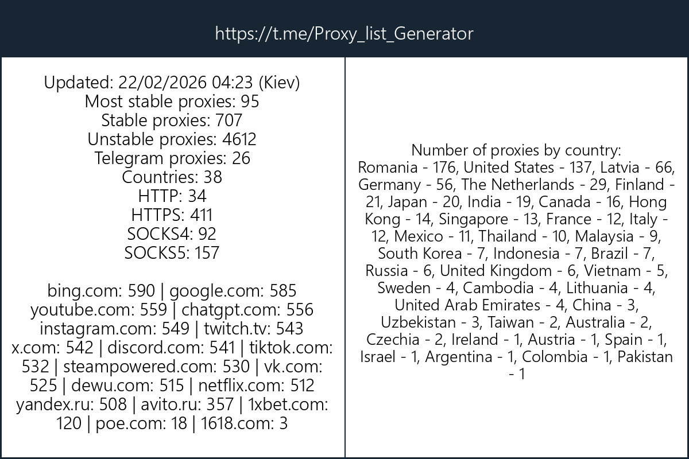

# 🚀 ProxyGenerator — Free Proxy List (HTTP, HTTPS, SOCKS4, SOCKS5)



## 📌 Introduction

This repository provides **high-quality, automatically checked proxy lists** updated regularly. Unlike standard scrapers, our system performs deep verification of every proxy to ensure reliability, speed, and anonymity.

---

## 🚀 Key Features

*   **Deep Verification:** Every proxy is tested against real targets (Google, YouTube, etc.).
*   **Protocol Support:** HTTP, HTTPS, SOCKS4, SOCKS5.
*   **High Speed:** Only proxies with low latency make it to the "MostStable" list.
*   **Secure:** Strict SSL/TLS handshake verification.
*   **Categorized:** Sorted by country, protocol, and specific website access.

---

## 📥 Download Proxies

| Protocol | 🛡️ MostStable (Elite) | ⚖️ Stable (General) | ⚠️ Unstable (Alive) |
| :--- | :--- | :--- | :--- |
| **HTTP** | [Download](https://raw.githubusercontent.com/proxygenerator1/ProxyGenerator/main/MostStable/http.txt) | [Download](https://raw.githubusercontent.com/proxygenerator1/ProxyGenerator/main/Stable/http.txt) | [Download](https://raw.githubusercontent.com/proxygenerator1/ProxyGenerator/main/Unstable/http.txt) |
| **HTTPS** | [Download](https://raw.githubusercontent.com/proxygenerator1/ProxyGenerator/main/MostStable/https.txt) | [Download](https://raw.githubusercontent.com/proxygenerator1/ProxyGenerator/main/Stable/https.txt) | [Download](https://raw.githubusercontent.com/proxygenerator1/ProxyGenerator/main/Unstable/https.txt) |
| **SOCKS4** | [Download](https://raw.githubusercontent.com/proxygenerator1/ProxyGenerator/main/MostStable/socks4.txt) | [Download](https://raw.githubusercontent.com/proxygenerator1/ProxyGenerator/main/Stable/socks4.txt) | [Download](https://raw.githubusercontent.com/proxygenerator1/ProxyGenerator/main/Unstable/socks4.txt) |
| **SOCKS5** | [Download](https://raw.githubusercontent.com/proxygenerator1/ProxyGenerator/main/MostStable/socks5.txt) | [Download](https://raw.githubusercontent.com/proxygenerator1/ProxyGenerator/main/Stable/socks5.txt) | [Download](https://raw.githubusercontent.com/proxygenerator1/ProxyGenerator/main/Unstable/socks5.txt) |
| **ALL** | [Download](https://raw.githubusercontent.com/proxygenerator1/ProxyGenerator/main/MostStable/ALL.txt) | [Download](https://raw.githubusercontent.com/proxygenerator1/ProxyGenerator/main/Stable/ALL.txt) | [Download](https://raw.githubusercontent.com/proxygenerator1/ProxyGenerator/main/Unstable/ALL.txt) |

### 🔗 Quick Links
*   ✈️ **Telegram Ready:** [telegramProxys.txt](https://raw.githubusercontent.com/proxygenerator1/ProxyGenerator/main/telegramProxys.txt) (SOCKS5 verified for Telegram)
*   💾 **Full Database (JSON):** [all.json](https://raw.githubusercontent.com/proxygenerator1/ProxyGenerator/main/ALL/all.json) (Contains metadata: Country, Ping, Latency, Uptime)


### 📋 JSON Structure (one proxy)
```json
{
    "ip": "1.2.3.4",
    "port": 8080,
    "protocol": "socks5",
    "country": "Germany",
    "ping": 312,
    "status": "MostStable",
    "telegram": true,
    "ssl_cert_valid": true,
    "sites": { "google.com": true, "netflix.com": false, "...": "..." }
}
```

---

## 🛠️ How It Works (The Logic)

We don't just "ping" servers. Each proxy goes through a **long chain of independent tests** over ~30 minutes before it earns a place in the final list:

1.  **Connectivity Test:** Real requests to heavy websites (Google, YouTube, etc.) simulating a real user.
2.  **Security Check:** Proxies without SSL/TLS encryption support are discarded or downgraded.
3.  **Stress Test:** Multiple rounds of rechecks with cooldown intervals. Only the fastest and most stable proxies survive.

> ⏱️ A proxy that reaches "MostStable" has passed **every single stage** of this pipeline.

---


<details>
<summary>🔒 <b>Fix SSL / Hostname Mismatch Errors (Click to expand)</b></summary>
<br>

If you encounter `SSL: WRONG_VERSION_NUMBER`, `CERTIFICATE_VERIFY_FAILED`, or `Hostname mismatch` errors, this is **normal** for public HTTPS proxies that use shared certificates (CDN/Cloudflare).

To successfully use these proxies, you typically need to **disable strict SSL verification** for the proxy connection in your software.

### Python Code Examples

**1. Requests (Sync)**
```python
import requests
import urllib3

urllib3.disable_warnings()

# Important: Use the 'https' scheme
proxies = {"https": "https://IP:PORT"} 
requests.get("https://google.com", proxies=proxies, verify=False)
```

**2. Httpx (Async / Modern)**
```python
import httpx
import ssl

# Create a custom SSL context for the proxy connection
ctx = ssl.create_default_context()
ctx.check_hostname = False
ctx.verify_mode = ssl.CERT_NONE

mounts = {
    "https://": httpx.AsyncHTTPTransport(proxy=httpx.Proxy(url="https://IP:PORT", ssl_context=ctx)),
    "http://": httpx.AsyncHTTPTransport(proxy=httpx.Proxy(url="https://IP:PORT", ssl_context=ctx)),
}

async with httpx.AsyncClient(mounts=mounts, verify=False) as client:
    resp = await client.get("https://google.com")
```
</details>


---


<details>
<summary>💻 <b>Automated Download Examples (cURL, Python) - Click to expand</b></summary>
<br>

### 1. Simple CLI (cURL)
Get a list of high-speed SOCKS5 proxies:
```bash
curl -L "https://raw.githubusercontent.com/proxygenerator1/ProxyGenerator/main/MostStable/socks5.txt" -o socks5.txt
```

### 2. Python
Load proxies directly into your script:
```python
import requests
url = "https://raw.githubusercontent.com/proxygenerator1/ProxyGenerator/main/Stable/http.txt"
proxies = requests.get(url).text.strip().split("\n")
print(f"Loaded {len(proxies)} proxies")
```
</details>


---

## 📂 Repository Structure

The data is organized for instant use:

### 🌟 Quality Categories
*   **`MostStable/`** — The Elite tier. High speed, full anonymity, 100% success rate on strict targets.
*   **`Stable/`** — Reliable workhorses. Good speed, suitable for most tasks.
*   **`Unstable/`** — Alive but pending re-verification or having higher latency.

### 🌍 By Country
Inside `Stable` and `MostStable` folders, you'll find a **`country/`** directory.
*   *Example:* `MostStable/country/Germany/socks5.txt`

### 🎯 For Specific Sites (`ForSites/`)
**The most valuable feature.** Proxies in these folders have **guaranteed access** to specific services:
*   📺 **Netflix:** `ForSites/netflix/`
*   🔍 **Google:** `ForSites/google/`
*   📸 **Instagram:** `ForSites/instagram/`
*   🎮 **Discord:** `ForSites/discord/`

---

## ⚖️ Disclaimer

This software and the provided lists are for **educational purposes only**. The repository owner is not responsible for any misuse of the provided material. The proxies are public and gathered from open sources.
