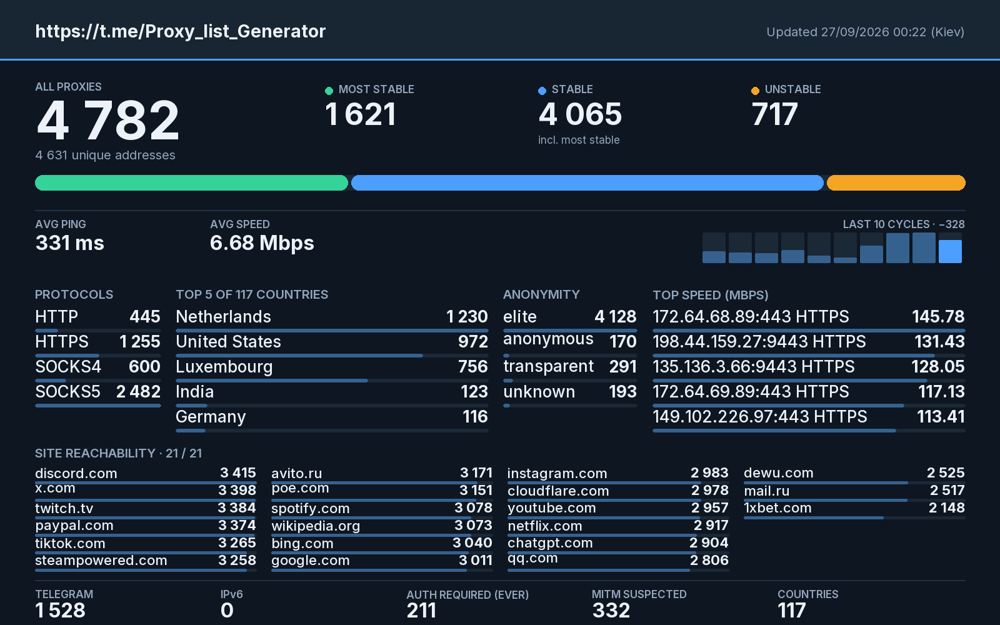

# ProxyGenerator — free proxy lists (HTTP, HTTPS, SOCKS4, SOCKS5)

Public proxy lists, rebuilt from scratch on every update. An address gets in only after it
carried real traffic to a real site — an open port is not enough — and every record is dated,
so you can see how old it is before you rely on it.

**Start with [`Stable/ALL.txt`](https://raw.githubusercontent.com/proxygenerator1/ProxyGenerator/main/Stable/ALL.txt)** — one file, all four protocols, the general-purpose pool.
If your tool accepts nothing but a bare `ip:port`, read [why the HTTPS lists look dead to a checker](#why-the-https-lists-look-dead-to-a-checker)
first: one of those four protocols needs more than the address.



## Download

Each column is a tier: how much the address has proven, not what it can do.

| Protocol | MostStable | Stable | Unstable |
| :--- | :--- | :--- | :--- |
| HTTP | [`MostStable/http.txt`](https://raw.githubusercontent.com/proxygenerator1/ProxyGenerator/main/MostStable/http.txt) | [`Stable/http.txt`](https://raw.githubusercontent.com/proxygenerator1/ProxyGenerator/main/Stable/http.txt) | [`Unstable/http.txt`](https://raw.githubusercontent.com/proxygenerator1/ProxyGenerator/main/Unstable/http.txt) |
| HTTPS | [`MostStable/https.txt`](https://raw.githubusercontent.com/proxygenerator1/ProxyGenerator/main/MostStable/https.txt) | [`Stable/https.txt`](https://raw.githubusercontent.com/proxygenerator1/ProxyGenerator/main/Stable/https.txt) | [`Unstable/https.txt`](https://raw.githubusercontent.com/proxygenerator1/ProxyGenerator/main/Unstable/https.txt) |
| SOCKS4 | [`MostStable/socks4.txt`](https://raw.githubusercontent.com/proxygenerator1/ProxyGenerator/main/MostStable/socks4.txt) | [`Stable/socks4.txt`](https://raw.githubusercontent.com/proxygenerator1/ProxyGenerator/main/Stable/socks4.txt) | [`Unstable/socks4.txt`](https://raw.githubusercontent.com/proxygenerator1/ProxyGenerator/main/Unstable/socks4.txt) |
| SOCKS5 | [`MostStable/socks5.txt`](https://raw.githubusercontent.com/proxygenerator1/ProxyGenerator/main/MostStable/socks5.txt) | [`Stable/socks5.txt`](https://raw.githubusercontent.com/proxygenerator1/ProxyGenerator/main/Stable/socks5.txt) | [`Unstable/socks5.txt`](https://raw.githubusercontent.com/proxygenerator1/ProxyGenerator/main/Unstable/socks5.txt) |
| All four | [`MostStable/ALL.txt`](https://raw.githubusercontent.com/proxygenerator1/ProxyGenerator/main/MostStable/ALL.txt) | [`Stable/ALL.txt`](https://raw.githubusercontent.com/proxygenerator1/ProxyGenerator/main/Stable/ALL.txt) | [`Unstable/ALL.txt`](https://raw.githubusercontent.com/proxygenerator1/ProxyGenerator/main/Unstable/ALL.txt) |

`Stable/` already includes everything in `MostStable/`, so taking both is taking the same
addresses twice. `MostStable/` is the smallest list with the best odds and the only one with
no confirmed HTTPS tampering. `Unstable/` is everything else that was alive recently.
Most of `MostStable/` is `https`, so read [why the HTTPS lists look dead to a checker](#why-the-https-lists-look-dead-to-a-checker)
before you judge it by a checker.

### Other cuts

| You want | Take |
| :--- | :--- |
| one country | [`Stable/country/`](https://github.com/proxygenerator1/ProxyGenerator/tree/main/Stable/country) — for example `Stable/country/Germany/socks5.txt` |
| proxies that opened a given site | [`ForSites/`](https://github.com/proxygenerator1/ProxyGenerator/tree/main/ForSites) — for example `ForSites/netflix.com/ALL.txt` |
| a given anonymity level | [`ForAnonymity/elite/ALL.txt`](https://raw.githubusercontent.com/proxygenerator1/ProxyGenerator/main/ForAnonymity/elite/ALL.txt) or [`ForAnonymity/anonymous/ALL.txt`](https://raw.githubusercontent.com/proxygenerator1/ProxyGenerator/main/ForAnonymity/anonymous/ALL.txt) |
| to select on anything else | [`ALL/all.json`](https://raw.githubusercontent.com/proxygenerator1/ProxyGenerator/main/ALL/all.json) — every record with every field |

[`ALL/ALL.txt`](https://raw.githubusercontent.com/proxygenerator1/ProxyGenerator/main/ALL/ALL.txt)
is not a selected list: it is the three tiers merged into one file.

### Line format

One `ip:port` per line, UTF-8, sorted by address. IPv6 looks like `[2001:db8::1]:1080`.
An empty list is a zero-byte file; a non-empty one ends with a newline. Each file holds the
current snapshot in full — there is nothing to merge with a previous download, replace it.

Top-level files and the `ForAnonymity/` cuts always exist and may be empty. Inside `country/`
and `ForSites/` a file appears only once it has at least one line, so a country with no
SOCKS4 proxy simply has no `socks4.txt`.

## Why the HTTPS lists look dead to a checker

Three of the four protocols behave the way a proxy tool expects: give the client an `ip:port`
from `http.txt`, `socks4.txt` or `socks5.txt` and it connects.

`https` is not one of them, and the word does not mean here what it means in most lists. It is
not "an HTTP proxy that can carry HTTPS" — that is `http`, and the `http.txt` files already do
it. It means the hop *to the proxy itself* is TLS: the client has to complete a TLS handshake
with the proxy before it can ask for anything at all. Reach the same port with a plain
request and the proxy either replies with a TLS error page or closes the connection without
a word.

**A tool that accepts nothing but `ip:port` cannot use these, and cannot test them either.**
It speaks plain HTTP to a port that refuses plain HTTP, gets back nothing it can read, and
reports the address as dead. That verdict describes the tool, not the address: the same
address can be carrying traffic at the moment the checker calls it dead.

Two things follow. If your tool takes a bare address and offers no way to say more, use
`http.txt`, `socks4.txt` and `socks5.txt` and leave `https.txt` alone. And do not read a
checker's report on an `https` list as a measurement of that list — `https` is the protocol
that lasts longest here, so it is most of what `MostStable/` holds, and a plain checker will
call nearly all of it dead.

Where the client does support it, name the scheme instead of passing a bare address:

```bash
curl --proxy "https://ADDRESS" --proxy-insecure https://example.com
```

`--proxy-insecure` concerns the certificate the proxy serves for itself, which these make on
their own and which no authority vouches for; `tls.proxy_cert` reports it as `untrusted`. It
does not relax the certificate of the site you asked for: that one is still verified, and a
site whose certificate has expired still fails. Watch for clients that offer a single switch
for both — turning that one off hands the contents of the tunnel to the proxy operator too.

## What you get

Each record carries the facts that were true about it at the time of the check, and the
timestamps to judge how stale they are.

* **It moved real traffic.** Not "the port answered" and not "the tunnel opened" — a request
  went through the proxy to a real site and the response came back and was checked.
  `last_ok_at` says when.
* **Unknown is published as unknown.** `tls.mitm_suspected` and `tls.cert_self_signed` are
  `null` when there was nothing to compare against, never `false`. Elsewhere a `false` can
  also mean "not measured" — the field list below says which is which.
* **HTTPS tamperers are labelled, not hidden.** They stay in the ordinary lists and never
  reach the strictest one.
* **Per-site results are published per site**, not collapsed into a single "works".
* **Anonymity is a label, not a rank.** `anonymity.level` records what was observed at the
  time of that check, in a field of its own — do not read it as a stronger or weaker `tier`.
* **`auth_required: true` is a sticky mark, not a live state.** The address asked for a login
  at some point; `last_ok_at` on the same record dates a request that went through without one.

## Before you use these

> [!WARNING]
> These are public proxies. Nobody involved in this project runs them. Whoever does run one
> can see, log and modify everything passing through it — assume they do.

* Never send logins, passwords, cookies or personal data through a public proxy.
* A checker that only takes `ip:port` reports every `https` address as dead — see
  [why the HTTPS lists look dead to a checker](#why-the-https-lists-look-dead-to-a-checker).
* HTTPS keeps the payload from the operator only while your client verifies the certificate,
  and some of these proxies replace it — see
  [proxies that replace the HTTPS certificate](#proxies-that-replace-the-https-certificate).
* Free proxies die fast. Re-download before a run and read `last_ok_at` and `last_check_at`
  on the record instead of trusting the file to still be current.
* An address that disappeared from the lists is not banned forever: it drops out when it
  stops answering and comes back if it starts again, under the same `ip:port`.

## Proxies that replace the HTTPS certificate

Some public proxies terminate TLS themselves and hand your client a certificate they made.
Over plain HTTP such a proxy behaves like any other. Over HTTPS the certificate you receive
is not the real one: a client that verifies certificates refuses to connect — that error is
the proxy being caught, not a bug in your code — while a client with verification switched
off connects happily and lets the operator read, and alter, everything inside the tunnel.

> [!IMPORTANT]
> Such proxies are marked, not hidden, and they are not kept apart: they sit in the ordinary
> lists next to everything else. `MostStable/` is the one place they never reach.

The mark is `tls.mitm_suspected: true` in `ALL/all.json`. A marked address keeps the tier its
measurements earned, up to `Stable`: the tier says how reliably it carries traffic, and an
interceptor can be as fast and as long-lived as any other box. `MostStable/` is the exception
because that tier stands for TLS verified all the way to the target, and a replaced
certificate is exactly what fails that check.

Interception is not spread evenly across the four protocols, and the difference is large
enough to shape the lists. Among the SOCKS records it is the common case; among the `https`
ones it is the exception. That is why `MostStable/socks4.txt` and `MostStable/socks5.txt` are
so much thinner than the rest of the column — the tier treats every protocol the same way,
and what differs is the population each one draws from. Count `tls.mitm_suspected` per
`protocol` in `ALL/all.json` and you will see it.

**So:** fine when all you need is a different source address for something public; not where
the content of the traffic matters.

<details>
<summary>How to select against them</summary>

Picking a folder gets you almost nowhere: every list except `MostStable/` can contain them —
`Stable/`, the `country/` cuts under it, `ForSites/`, `ForAnonymity/`, `Unstable/`,
`ALL/ALL.txt` and `telegramProxys.txt`. The field is what you want, and the field is in
`ALL/all.json`.

`mitm_suspected` has three values, not two: `true` (caught), `false` (compared against the
real certificate and matched) and `null` (nothing to compare against, so nobody knows). The
two obvious tests therefore give you two different lists.

```python
import requests

url = "https://raw.githubusercontent.com/proxygenerator1/ProxyGenerator/main/ALL/all.json"
rows = requests.get(url).json()

# Verified clean: only records that were actually compared and matched.
# The shorter list — most records have nothing to compare against.
clean = [r for r in rows if r["tls"]["mitm_suspected"] is False]

# Not caught: drops the confirmed interceptors, keeps the unknowns.
# The longer list — some of what stays in it was never verified.
not_caught = [r for r in rows if r["tls"]["mitm_suspected"] is not True]
```

A plain `if not r["tls"]["mitm_suspected"]` behaves like the second form, not the first:
`null` is falsy, so the unknowns stay in.

Read `mitm_suspected`, not `ssl_cert_valid`: an interceptor whose certificate is issued by an
authority your system trusts still passes a strict handshake, so `ssl_cert_valid` can be
`true` while `mitm_suspected` is `true` as well.

</details>

## What is in the repository

| Folder | What it holds |
| :--- | :--- |
| `MostStable/` | The strictest cut: smallest list, best odds, and the only one with no `tls.mitm_suspected: true` records — `null` still occurs here. |
| `Stable/` | The general-purpose pool. Includes everything in `MostStable/`, and can contain marked records. |
| `Unstable/` | Everything else that was alive recently. Take it if you need volume. |
| `ForSites/` | One folder per host, holding the addresses that opened that site on their last site check. `Unstable` is excluded. |
| `ForAnonymity/` | Two cuts, `elite` and `anonymous`, all tiers mixed. `transparent` and `unknown` get no folder of their own. |
| `ALL/` | The three tiers merged, plus the two machine-readable files. |

**By country.** `Stable/` and `MostStable/` each carry a `country/` directory — for example
`MostStable/country/Germany/socks5.txt`. Folders are named after the full English country
name, `Unknown` when it could not be determined, and the same place is always spelled the
same way — `Turkey`, never `Türkiye` — so a path you saved keeps working. There are no
country folders under `Unstable/`, and `by_country` in `ALL/meta.json` counts every country
of the update including those — the folders that actually exist are listed in
`export.tree.countries`.

The country is where the address routes from, not where its owner is registered: a block held
by a US company but switched on in Germany is published as Germany, because that is the one
that matters when you pick a proxy to appear from somewhere.

**By site.** `ForSites/` holds one folder per host, named after the host:

```text
google.com   paypal.com  bing.com        youtube.com   twitch.tv   instagram.com
tiktok.com   avito.ru    steampowered.com  netflix.com  spotify.com  x.com
discord.com  wikipedia.org  poe.com      chatgpt.com   dewu.com   1xbet.com
cloudflare.com  qq.com   mail.ru
```

Treat it as a strong hint rather than a guarantee: site results carry their own timestamp in
`sites_checked_at`, and a pass that could not be finished is flagged `sites_partial: true`.

Those are folder names. The same checks appear in `ALL/all.json` under `sites`, keyed by the
full URL — the folder `ForSites/netflix.com/` is the key `https://netflix.com`.

## The data files

| File | What it is for |
| :--- | :--- |
| [`ALL/all.json`](https://raw.githubusercontent.com/proxygenerator1/ProxyGenerator/main/ALL/all.json) | Every record with every field. This is the file to use when you select from a script. |
| [`ALL/meta.json`](https://raw.githubusercontent.com/proxygenerator1/ProxyGenerator/main/ALL/meta.json) | Counts and the timestamp of the current update, without downloading the full list. |
| [`stats.txt`](https://raw.githubusercontent.com/proxygenerator1/ProxyGenerator/main/stats.txt) | The picture above as plain text, for grepping. |
| [`telegramProxys.txt`](https://raw.githubusercontent.com/proxygenerator1/ProxyGenerator/main/telegramProxys.txt) | Ready-to-click `t.me/socks` links. SOCKS5 over IPv4 only, all tiers mixed; empty when no record qualifies. |

The root of `all.json` is an array of objects, timestamps are ISO-8601 UTC.

<details>
<summary>Fields of a record in ALL/all.json</summary>

**Address**

| Field | Meaning |
| :--- | :--- |
| `ip`, `port` | The address. `addr` is the same thing as one string, with brackets for IPv6. |
| `protocol` | `http`, `https`, `socks4` or `socks5`. `scheme` is the dialect that actually worked, for example `socks5h`. |
| `family` | `4` or `6`. |
| `country` | Full English name, `Unknown` when it could not be determined. |

**How much it has proven**

| Field | Meaning |
| :--- | :--- |
| `status` | `MostStable`, `Stable` or `Unstable` — the same value as `tier`, which spells it `most_stable`. |
| `uptime_ratio` | Share of successful checks in the recent history of that record. |
| `ok_streak`, `fail_streak` | Consecutive successes and failures at the end of that history. |
| `rtt_ms` | TCP round trip. `ping` carries the same number but uses `0` instead of `null`. |
| `latency_http_ms` | Time to first byte through the proxy. |
| `speed` | `down_kbps` / `up_kbps` in kilobits per second, with `measured_at`. Measured only for candidates for the strictest tier, so most records carry `null` here. `down_bytes`, `up_bytes`, `down_ms` and `up_ms` are not populated. |

**Safety**

| Field | Meaning |
| :--- | :--- |
| `tls.mitm_suspected` | `true` caught replacing the certificate, `false` compared and matched, `null` nothing to compare against. |
| `tls.tls_to_target`, `ssl_cert_valid` | The same fact under two names: a strict TLS connection stood up through the proxy to the host used for the check. It says the tunnel carries TLS intact, not that your own target will open. |
| `tls.cert_self_signed` | Three-valued like `mitm_suspected`. |
| `tls.proxy_cert*` | About the certificate the proxy itself served, not the target's. `proxy_cert` is a verdict — `none`, `untrusted` or `valid` — with `proxy_cert_issuer` and `proxy_cert_expires` beside it. Reported, never a reason to drop a record. |
| `anonymity.level` | `elite`, `anonymous`, `transparent` or `unknown`, as observed at the time of the check. |
| `anonymity.leak_headers` | The headers that gave the client away, when any did. `exit_ip` is blank when the check did not run, and deliberately blank for `transparent` records. `exit_differs` is always `null` and `real_ip_in_headers` is always `false`: neither is measured, so read `leak_headers` and ignore those two. |
| `auth_required` | The address asked for a login at some point. Ones that ask for it now are not in the lists. |

**Sites and Telegram**

| Field | Meaning |
| :--- | :--- |
| `sites` | One entry per target of the site map, keyed by the full URL that was requested: mostly `https://` plus the host, but `http://cloudflare.com`, `http://qq.com` and `http://mail.ru` are checked over plain HTTP. `true` means the site opened; `false` means it is not confirmed, which is not the same as "blocked". |
| `sites_ok_count`, `sites_partial` | How many opened, and whether the pass was cut short. |
| `telegram`, `telegram_link` | Whether the address works as a Telegram proxy, and the ready-made link. The link is filled in for SOCKS5 over IPv4 only, so `telegram: true` can sit beside `telegram_link: null`. |

**Dates** — `first_ok_at`, `last_ok_at`, `last_check_at` for the record; `sites_checked_at`,
`tier_at`, `anonymity_at`, `tls_at`, `telegram_at` for the individual facts, so you can tell
a fresh verdict from one that has been carried forward.

The `tls` block carries more than the rows above: `connect_support`, `tls_version`, `alpn`,
`cipher`, `cert_issuer_cn`, `cert_subject_cn`, `cert_spki_sha256`, `tls_downgrade` and
`alpn_lost` describe the handshake that was observed.

</details>

<details>
<summary>Fields of ALL/meta.json</summary>

| Field | Meaning |
| :--- | :--- |
| `generated_at` | When this update was built. Compare it with your clock to see how fresh what you hold is. |
| `schema_version` | Version of the record layout in `all.json`. |
| `counts` | `unique_proxies` (distinct addresses), `protocol_records` (rows in `all.json`, one address can appear under two protocols), `telegram`, `ipv6_records`, `mitm_suspected`, `auth_required`. |
| `stable_total` | Records in `Stable/` counting everything inherited from `MostStable/`. One address can hold a record under two protocols, so this runs ahead of the line count of `Stable/ALL.txt`. |
| `by_tier`, `by_protocol`, `by_country`, `by_anonymity` | The same population split four ways. |
| `sites_reachable` | How many addresses opened each target, under the same URL keys as `sites`. |
| `export` | `files` and `bytes` of the current update, `built_at`, and `tree` — how many lines the published files hold, plus the country and site folder names that exist, so you can see what is there before requesting it. |

</details>

## Examples

<details>
<summary>Downloading and selecting (cURL, Python, Node.js, Go)</summary>

**cURL**

```bash
curl -L "https://raw.githubusercontent.com/proxygenerator1/ProxyGenerator/main/MostStable/socks5.txt" -o socks5.txt
```

**Python — load a list**

```python
import requests

url = "https://raw.githubusercontent.com/proxygenerator1/ProxyGenerator/main/Stable/http.txt"
proxies = requests.get(url).text.split()
print(f"Loaded {len(proxies)} proxies")
```

**Python — select from the JSON**

```python
import requests

url = "https://raw.githubusercontent.com/proxygenerator1/ProxyGenerator/main/ALL/all.json"
rows = requests.get(url).json()

# SOCKS5 records that opened Netflix and were not caught intercepting TLS.
# `is not True` keeps the ones where nothing could be compared (null = unknown).
picked = [
    r for r in rows
    if r["protocol"] == "socks5"
    and r["sites"].get("https://netflix.com")
    and r["tls"]["mitm_suspected"] is not True
]
print(len(picked), "matches")
```

**Python — how fresh is what I hold**

```python
import requests
from datetime import datetime, timezone

meta = requests.get(
    "https://raw.githubusercontent.com/proxygenerator1/ProxyGenerator/main/ALL/meta.json"
).json()

generated = datetime.fromisoformat(meta["generated_at"].replace("Z", "+00:00"))
print("built", datetime.now(timezone.utc) - generated, "ago")
```

**Node.js**

```js
const url = "https://raw.githubusercontent.com/proxygenerator1/ProxyGenerator/main/Stable/socks5.txt";
const proxies = (await (await fetch(url)).text()).split("\n").filter(Boolean);
console.log(`Loaded ${proxies.length} proxies`);
```

**Go**

```go
resp, _ := http.Get("https://raw.githubusercontent.com/proxygenerator1/ProxyGenerator/main/Stable/socks5.txt")
body, _ := io.ReadAll(resp.Body)
proxies := strings.Fields(string(body))
fmt.Println("Loaded", len(proxies), "proxies")
```

</details>

<details>
<summary>Fixing SSL and hostname mismatch errors</summary>

If you get `SSL: WRONG_VERSION_NUMBER`, `CERTIFICATE_VERIFY_FAILED` or `Hostname mismatch`
when connecting **to an HTTPS proxy from these lists**, that is expected: public HTTPS
proxies serve self-signed or foreign certificates. That certificate belongs to the proxy
itself, and `tls.proxy_cert` says how it checked out.

Relax verification **for the connection to the proxy** and keep it enabled for the connection
to your target — that second one is what protects your data.

`verify=False` in `requests` does not separate the two: it also switches off the check of the
target certificate, and that check is exactly what exposes an intercepting proxy. Only the
`httpx` form below relaxes the proxy connection alone.

**requests (sync)**

```python
import requests
import urllib3

urllib3.disable_warnings()

# Use the 'https' scheme for the proxy itself.
proxies = {"https": "https://IP:PORT"}

# verify=False also stops the target certificate from being checked, so an
# intercepting proxy will not raise here. Prefer the httpx form below.
requests.get("https://example.com", proxies=proxies, verify=False)
```

**httpx (async)**

```python
import httpx
import ssl

# A relaxed SSL context for the connection to the proxy ONLY.
ctx = ssl.create_default_context()
ctx.check_hostname = False
ctx.verify_mode = ssl.CERT_NONE

mounts = {
    "https://": httpx.AsyncHTTPTransport(proxy=httpx.Proxy(url="https://IP:PORT", ssl_context=ctx)),
    "http://": httpx.AsyncHTTPTransport(proxy=httpx.Proxy(url="https://IP:PORT", ssl_context=ctx)),
}

# No verify=False on the client: the certificate of the target is still checked,
# and that check is what turns an intercepting proxy into an error instead of a
# silent leak.
async with httpx.AsyncClient(mounts=mounts) as client:
    resp = await client.get("https://example.com")
```

</details>

## Updates

The lists are rebuilt from scratch and replaced in full; nothing accumulates between updates.
There is no schedule to rely on — read `generated_at` in
[`ALL/meta.json`](https://raw.githubusercontent.com/proxygenerator1/ProxyGenerator/main/ALL/meta.json)
and the per-record timestamps, and decide from those whether what you hold is fresh enough
for what you are doing.

[@Proxy_list_Generator](https://t.me/Proxy_list_Generator) announces every update. Problems
with the data — a field that contradicts itself, a file that will not parse, a link that
leads nowhere — belong in the
[issue tracker](https://github.com/proxygenerator1/ProxyGenerator/issues).

If you pull these files from a script, cache what you downloaded and re-read it locally
instead of requesting the same file on every run: `raw.githubusercontent.com` throttles
repeated requests, and `ALL/all.json` is the largest file here.

## License and disclaimer

Released under the [MIT License](./LICENSE) — use, modify and redistribute freely, with no
warranty of any kind. The lists describe what was observed about third-party machines nobody
here operates.

For **educational purposes only**. The repository owner is not responsible for any misuse of
the material provided.
